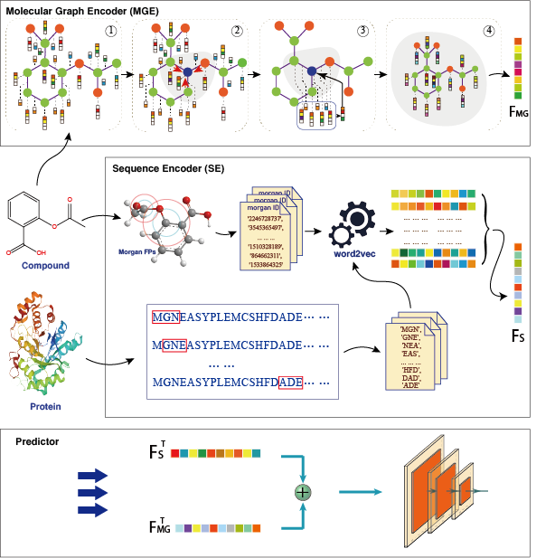

# A deep learning method for predicting molecular properties and compound-protein interactions
## Introduction
This is a PyTorch implementation of the research: [A deep learning method for predicting molecular properties and compound-protein interactions](https://github.com/happay-ending/cpi_cpp)

This repository contains a brief description of the paper, source code, data and program run instructions.

----
* [Overview of MG-S](#overview-of-mg-s)
* [Deep Learning Encoder](#deep-learning-encoder)
    * [Molecular Graph Encoder](#molecular-graph-encoder)
    * [Sequence Encoder](#sequence-encoder)
 * [Predictor](#predictor)
* [Data Sets used](#data-sets-used)
* [Data File](#data-file)
* [Using](#using)
----

## Overview of MG-S



MG-S consists of three modules, namely molecular featureization, deep learning encoder and predictor module. The deep learning encoder module consists of two concurrently executed submodules: MGE and SE. In molecular property prediction, MGE is used to learn the molecular structure of compounds and SE is employed to extract organ fingerprint feature of compounds and convert them into  deep feature descriptor. Finally, the deep feature descriptors are sent to predictor for classification. In CPI prediction, MGE is utilized to learn the molecular structure of compounds and SE is used to learn amino acid sequence fingerprints of the relevant proteins, then convert them into the matrix and sent this new feature descriptors to predictor.

(A) In MGE sub-module, each small molecule is represented with $d$-dim vectors $v \in V^{n \times d} $ via molecular graph embedding. 

(B) In SE sub-module, each compound SMILES or protein sequence is represented by word embedding with $f$-dim semantic vectors $v \in V^{n \times f}$. 

(C) After aggregating $F_{MG}$ and $F_{S}$ in the end of MGE \& SE, it is used as input to the predictor module. "$\oplus$" represents "concatenation" operation.

----

## Deep Learning Encoder

MG-S uses a deep learning encoder to learn high-level features of compounds or proteins by multiple views as shown in Figure 1. It consists of two concurrent sub-modules: MGE and SE. In MGE, a deep hidden feature representation $F_{MG}$ of each small molecule compound is learned, and its dimension $dim_{MG}$ is determined by sub-model learning. In SE, compound SMILES or protein FASTA sequences are input and the sequence-based hidden feature representation $F_S$ is learned, and its dimension $dim_S$ is determined in the learning process. 

----
### Molecular Graph Encoder

We represent abstractly the molecule $\mathcal{M}$ as a graph $G_\mathcal{M}=(V, E)$, where $V$ denotes the set of nodes (atoms), $E$ denotes the set of edges (bonds). Let $v$, $w$ denote any node (atom), $(v, w)$ denote any edge (bond), $N(v)$ denote the set of neighbors of node $v$ in molecular graph, the initial features of node $v$ are denoted as $x_v$, and features of edge $(v, w)$ are denoted as $e_{vw}$.
The MPNN model is considered as two phases: message passing phase and readout phase.

In the message passing phase, the message passing function is defined as follows:

$$h_v^{t+1}=U_t(h_v^t,\sum_{w \in N(v)}M_t(h_v^t,h_w^t,e_{vw})) \tag{1}$$  

where $M_t$ denotes message function, $U_t$ is update function, and $h_v^0=x_v$.

In the readout phase, the readout function $R$ is applied to generate a feature representation of entire graph, which is defined as follows:

$$\hat{y}=R(h_v^T|v \in G) \tag{2}$$

Firstly, the initial structural features of molecule are obtained by DGL-LifeSci python package. Secondly, the features of neighboring nodes pass to central node in the form of messages during the message passing phase. After that, the messages of central node are updated with the messages of neighboring nodes and itself. Similarly, MPNN learns features of edges by introducing hidden state information of all edges and using Equation 1. Finally, the message readout phase generates a feature representation of molecule based on hidden states of nodes and edges.

----
### Sequence Encoder
SE employs word2vec to extract substructure features from SMILES or FASTA, as shown in Figure. The canonical SMILES is considered as "sentences". Each "sentence" can be split into multiple "words", and corresponding "word" is compound substructure derived from the Morgan algorithm. Finally, these "sentences" are encoded into high-dimensional vectors, and the embedding vectors of the molecules are obtained by summing the vectors of the individual substructures.

Proteins are considered as "sentences" of length ${n}$ consisting of 20 amino acid residues, and the set of these "sentences" is called the protein "corpus ". After that, each "sentence" in the corpus is shifted one amino acid at a time and split into overlapping 3-gram amino acid sequences to generate all possible "words". All "words" are then translated into real-valued high-level embedding vectors by the pre-training method word2vec. Finally, each protein "sentence" is represented using the sum of the high-dimensional feature vectors of its "words". 

----
### Predictor
The predictor module consists of a multilayer perceptron. In the experiments, the number of layers and the number of neurons of the predictor are set based on training dataset using hyperparameter tuning tool. Here, the module is defined in Equation:
$$h_1=\sigma(b^{(0)}+W^{(0)}(F_{MG}\oplus F_S)) $$

$$h_{i+1}=\sigma(b^{(i)}+W^{(i)}h_{i}) $$

$$\hat{h}_{i+1}= \frac{h_{i+1} - \mathrm{E}[h_{i+1}]}{\sqrt{\mathrm{Var}[h_{i+1}] + \epsilon}} * \gamma + \beta $$

$$\hat{y}=softmax(\hat{h}_{L})$$

where $\sigma(.) $ is activation function, here we use $ReLU$ function, $W^{(i)}$ and $b^{(i)}$ are learnable weight matrices and biases in each layer, $F_{MG}$ and $F_S$ are depth feature matrices learned by MGE and SE,  "$\oplus$" indicates concatenation operation, $h_{i+1}$ is the hidden feature at layer $(i+1)th$. ${\hat{h}}_{i+1}$ is batch normalization function, $\gamma$ and $\beta$ are learnable parameter vectors of size $C$ (where $C$ is the size of $h_{i+1}$), $\epsilon$ is a constant added to the mini-batch variance for numerical stability. $\hat{h}_{L}$ is the output feature of the last hidden layer.

----
## Data Sets Used

1. **BACE.** Inhibition was predicted on the BACE dataset provided by MoleculeNet. BACE 1 ($\beta$-secretase 1) is an important aspartate protease that forms myelin in peripheral nerve cells and is a transmembrane protein that encompasses two active sites.

2. **P53.** Agonist predictions was performed for bioassay record on P53 in PubChem (AID 720552). P53, a tumor suppressor protein, is activated following cellular insult, including DNA damage and other cellular stresses. The activation of P53 is a good indicator of DNA damage and other cellular stresses. 

3. **hERG.** The inhibitory effect of the widely studied cardiotoxicity-HERG single protein (ID: CHEMBL240) was predicted. Reduced functionality of hERG channel caused a prolonged QT interval, which lead to severe cardiotoxicity such as cardiac arrhythmia.

4. **Human** dataset include positive CPI pairs from DrugBank 4.1 and Matador \cite{gunther2007supertarget}, and highly credible negative samples of CPI pairs obtained by using a systematic screening framework. Human dataset contains 6728 interactions between 2726 unique compounds and 2001 unique proteins.

5. **Caenorbabditis elegans** dataset  is from the same source as the Human dataset. It contains 7786 interactions between 1767 unique compounds and 1876 unique proteins.
6. **KIBA** is derived from a method called KIBA, which combines kinase inhibitor bioactivities from different sources and indicators. It contains 229 unique proteins, 2111 unique drugs, and 118254 interactions.

    | Dataset 	| Targets 	| Compounds 	| Samples 	|  	|
    |:---:	|:---:	|:---:	|:---:	|:---:	|
    |  	|  	|  	| Positive 	| Negative 	|
    | BACE 	| - 	| 1507 	| 691 	| 822 	|
    | P53 	| - 	| 7460 	| 529 	| 6968 	|
    | hERG 	| - 	| 9804 	| 4668 	| 5136 	|
    | Human 	| 2001 	| 2726 	| 3364 	| 3364 	|
    | C.elegans 	| 1876 	| 1767 	| 3893 	| 3893 	|
    | KIBA 	| 229 	| 2111 	| 95525 	| 22729 	|
    |  	|  	|  	|  	|  	|

----

## Data File
Data file format: </br>
&nbsp;&nbsp;&nbsp;&nbsp;Datafile can be CSV and text as showd in the datasets. </br>

datasets/bace.csv </br>
datasets/P53.csv </br>
datasets/hERG.csv </br>

datasets/human.txt  </br>
datasets/celegans.txt </br>
datasets/KIBA/kiba.csv </br>
datasets/KIBA/ligands_smiles.csv </br>
datasets/KIBA/protein_seq.csv </br>

datasets/word2vec/: contains sequence-based pre-trained models.</br>
datasets/output/: contains the results of the experiments.</br>
datasets/KIBA/output:contains the results of KIBA.</br>

CPP_and_CPI_main.py ： the program file used in the paper.

----
## Environment
```
python	3.7.13
torch	1.11.0+cu102
dgl-cuda10.2	0.8.1
dgllife	0.2.9
rdkit	2018.09.3
gensim	4.2.0
networkx	2.2
numpy	1.21.6
pandas	1.3.5
scikit-learn    1.0.2
scipy	1.7.3
optuna  2.10.0
```
----
## Using
Run the program using the following command:

```
python CPP_and_CPI_main.py
```

**notes**: The paths and names of the six datasets are defined in the file_doc_info function body of the python CPP_and_CPI_main.py file (lines 443-455), and the corresponding dataset programs can be executed by replacing the file paths, filenames, and "type" variable as needed. 

The results are stored in the `output` folder after the program is run, and the training model parameters are stored in `output/model/`. 
